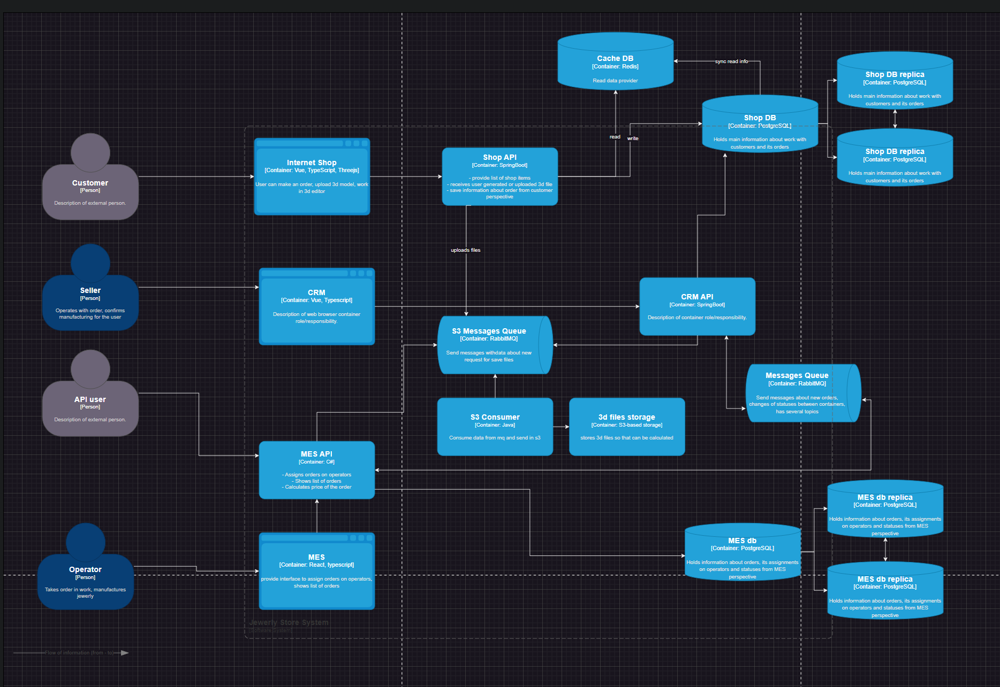

### Анализ схемы и описание системы

1. Взаимодействие с S3 является узким местом и возможной причиной потери данных.
2. Shop DB увеличивает latency b является точкой отказа системы.
3. Задержки при работе с для Shop data
4. "Тяжлеые" операции в процессе бэка увеличивают задержки и снижают возможности.
5. Согласованность данных.
6. Нет инструментов мониторинга и наблюдения.
7. Маунальное доставка кода в prod и release окружения.
8. Мануальное тестирование приводит к задержкам.
9. Безопасность

### Инициативы, которые необходимы для устранения нежелательных ситуаций.

- [ ] Использование очереди сообщений для взаимодействия с хранилищем 3D файлов.
   ```
   Дает возможность асинхронно взиамодействовать (клинет не ждет response) и повысить отказоустойчивость (если произошел
   отказ на стороне s3) - не теряем данные. Позволит независимо масштабироваться, если вырастет нагрузка и управлять
   потоком данных, чтобы избежать перегрузок. Определяет протокол взаимодействия с хранилищем, что будет стандартизировать
   работу. Резервирование, позволит не терять пользовательских данных.
  ```
- [ ] Shop DB. CQRS + репликация (Master-Slave) & шардирование

```
    CQRS
    Можем оптимизировать модель запросов под конкретные сценарии чтения. Модель команд и модель запросов могут масштабироваться
    независимо друг от друга. Разделение операций чтения и записи упрощает логику.
    Репиликация
    Повышает октазаустойчивость, так как не зависим от отказа одного из инстансов.
    Операции чтения/записи могут быть распределены между несколькими серверами.
    Шардирование
    Позвоиолт распределить нагрузку между несколькими серверами - повысит производительность и масштабируемость.
    Операции чтения и записи распределить между шардами - уменьшает конкуренцию за ресурсы.
    Если один шард выходит из строя, другие шарды продолжат работу.
```

- [ ] Кэширование для Shop data

```
    Быстрый доступ к часто запрашиваемым данным. К примеру, список доступных продуктов в магазине или информацию о каждом продукте.
    Уменьшение количества запросов к основной базе данных, отсюда возможность обрабатывать больше запросов без увеличения
    нагрузки на базу данных.
```

- [ ] Вынесение "тяжелых" задач в отдельных процесс

```
    Для задач подсчета/загрузки файлов использовать фоновые задачи. Увеличит пропускную способность системы, снизит задержки
    и позволит масштабироваться.
```

- [ ] Согласованность данных

```
    Сейчас, управление статусами просиходит в 3-х сервисах, что может привести к расхождению между таблицами. 
    Надо поддерживать сосгласованность и использовать механизмы обеспечения согласованности.
    Если смотреть глубже, то для дальнейшего масштабирования системы, стоит пересмотреть подход в целом и как архитектурный драйвер взять EDA.
```

- [ ] Микросервисная архитектура на базе EDA

```
    На дистанции поддержка текущего решения будет требовать большое количество ТРЗ и инвестиций в инфраструктуру, хорошим вариантом
    будет начало проектирования нового решения, готового к более серьезным нагрузкам.
```

- [ ] Мониторинг и наблюдение

```
    Рассмотреть вопрос о внедрении инструментов мониторинга, таких как Prometheus, Grafana, или ELK-стек.
```

- [ ] Автоматизация E2E тестирования

```
   Внедрении автоматизации тестирования, с использованием Selenium или Cypress.
```

- [ ] Расширить функциональность текущего CI/CD

```
    Стоит автоматизировать процесс доставки кода до release и prod окружения.
    Интегрировать в CI/CD E2E тесты.
```

- [ ] Безопасность

```
    Стоит задумать о внедрении SAST, SCA, проверок обрзаов (luntry/PT CS and etc.). Задумать о включении WAF. 
```

### Приоритеты

Есть проблема, связанная с ошибочно выбранной архитектурой на старте. Сейчас основную ценность несут простые задачи с
наибольшей пользой для повышения стабильности системы. Через пол года система система должна снизить колиечство не
полученных заказов до минимума. В Упрощенном виде будет выглядеть так:



Эпики расставлены согласно приоритета, поэтому первые 3 эпика из списка ниже, я бы делал.
1. Использование очереди сообщений для взаимодействия с хранилищем 3D файлов
2. Вынесение "тяжелых" задач в отдельных процесс
3. Кэширование для Shop data
4. Согласованность данных
5. Мониторинг и наблюдение
6. Shop DB. CQRS + репликация (Master-Slave) & шардирование
7. Расширить функциональность текущего CI/CD
8. Автоматизация E2E тестирования
9. Микросервисная архитектура на базе EDA
10. Безопасность
